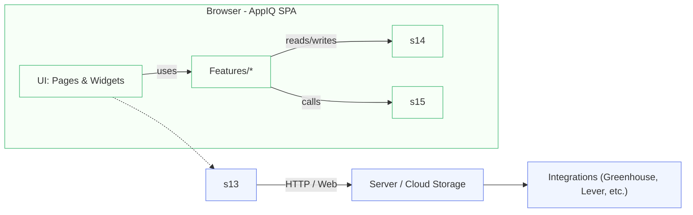

<!-- Architecture diagram for AppIQ (Mermaid) -->
# Architecture Diagram

The diagram below shows the high-level runtime components and data flows for AppIQ.

Notes:

- The client is an SPA (React + Vite) that persists to Dexie for offline capability.
- `Sync` represents a background process that reconciles local changes with the server.
- Integrations are implemented as isolated adapters and live on the server-side or as callable services.
